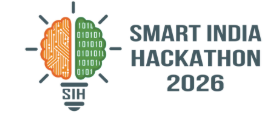
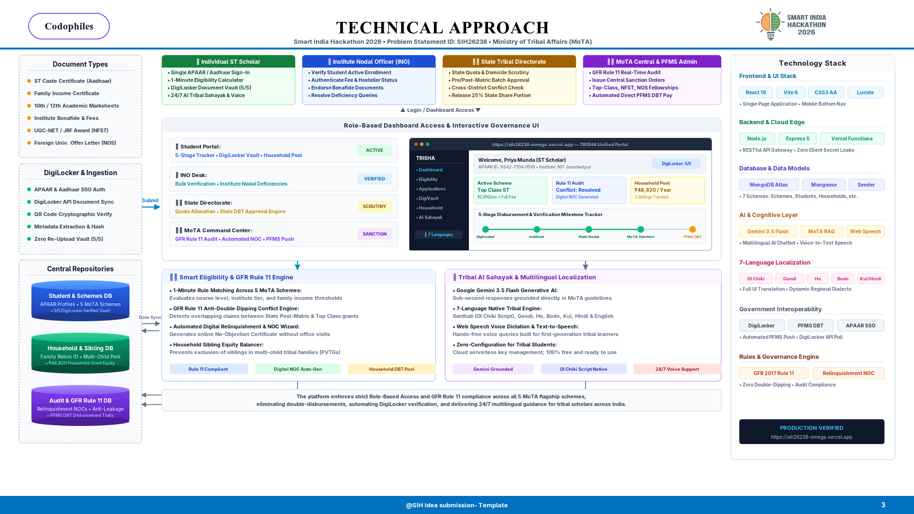

# 🏛️ TRISHA: Unified Scholarship & Fellowship Portal for Tribal Students

<p align="center">
  
</p>

<p align="center">
  <strong>Smart India Hackathon 2026 · Problem Statement ID: SIH26238</strong><br>
  <em>"Unified Scholarship Mobile Application for Tribal Students"</em><br>
  <strong>Ministry of Tribal Affairs (MoTA), Government of India</strong>
</p>

<p align="center">
  <a href="https://sih26238-omega.vercel.app"></a>
  <a href="https://github.com/shaheed3515/trisha-unified-scholarship-portal"></a>
  <a href="#"></a>
  <a href="#"></a>
  <a href="#"></a>
  <a href="#"></a>
</p>

---

## 📌 Quick Access & Links

* 🌐 **Live Deployed Prototype:** [https://sih26238-omega.vercel.app](https://sih26238-omega.vercel.app)
* 💻 **GitHub Repository:** [https://github.com/shaheed3515/trisha-unified-scholarship-portal](https://github.com/shaheed3515/trisha-unified-scholarship-portal)
* 📄 **Executive Project Report:** [PROJECT_REPORT.md](./PROJECT_REPORT.md)
* 🎥 **Video Walkthrough:** [YouTube Demonstration](https://youtu.be/your-video-id) *(Update with your video link)*

---

## 🎯 The Problem (SIH26238)

The **Ministry of Tribal Affairs (MoTA)** administers five flagship scholarship and fellowship schemes for Scheduled Tribe (ST) students. However, these programs have historically operated across **siloed, disconnected systems**:

1. **Pre-Matric & Post-Matric Scholarships:** Managed on National Scholarship Portal (NSP).
2. **Top Class Education Scheme (Premier Institutes):** Separate institutional workflows.
3. **National Fellowship for Higher Education (NFST for M.Phil / Ph.D.):** Hosted on Canara Bank SFMP.
4. **National Overseas Scholarship (NOS for Foreign Universities):** Hosted on a standalone MoTA portal.

### Major Pain Points Identified:
* 📑 **Document Fatigue:** Tribal students repeatedly carry physical documents to cyber cafés to scan and re-upload the same certificates across multiple portals.
* ⚠️ **GFR Rule 11 Conflicts (Double-Dipping):** Under General Financial Rules (GFR) Rule 11, students cannot draw overlapping benefits. When a student upgrades to a premier institute grant, verification delays freeze funds because there is no automated relinquishment mechanism.
* 🗣️ **Linguistic & Geographical Isolation:** Portals offer English and Hindi only, alienating first-generation tribal learners who speak native dialects like Santhali, Gondi, Ho, Bodo, or Kui.
* 👨‍👩‍👦 **Lack of Household & Sibling Tracking:** Portals treat students in isolation, leading to unfair quota exhaustion within single households and neglecting Particularly Vulnerable Tribal Groups (PVTGs).

---

## 💡 The Solution: TRISHA

**TRISHA** (*Tribal Integrated Scholarship & Higher-education Access*) is a unified digital platform and mobile-ready progressive web application that brings all 5 MoTA schemes under a single window with automated governance:

```
┌───────────────────────────────────────────────────────────────────────────────────┐
│                           TRISHA UNIFIED PORTAL                                   │
│            Single Window for All 5 Ministry of Tribal Affairs Schemes             │
├──────────────────────────┬──────────────────────────┬─────────────────────────────┤
│   Document Vault         │    Eligibility Engine    │   GFR Rule 11 Engine        │
│   • DigiLocker Sync      │    • 1-Minute Calculator │   • Conflict Detection      │
│   • Zero Re-Upload       │    • 5 Scheme Matching   │   • Digital NOC Wizard      │
├──────────────────────────┼──────────────────────────┼─────────────────────────────┤
│   Tribal AI Sahayak      │    Household Pool        │   5-Stage Tracker           │
│   • 7 Native Languages   │    • Sibling Grant View  │   • Institute to PFMS DBT   │
│   • Gemini Voice + Text  │    • PVTG Equity Guard   │   • 1-Click Document Sync   │
└──────────────────────────┴──────────────────────────┴─────────────────────────────┘
```

---

## 🚀 Key Features

### 1. 🔐 DigiLocker Certified Document Vault (Zero Re-Upload)
* Pulls verifiable digital credentials directly: ST Caste Certificate, Family Income, Marksheets, and Bonafide.
* Authenticated with cryptographic QR code validation.
* Once synced, documents automatically attach to any current or future MoTA scheme without physical scanning.

### 2. ⚡ GFR Rule 11 Conflict & Automated Digital NOC Engine
* Automatically cross-audits state and central databases to prevent duplicate disbursements.
* If an ST scholar qualifies for a higher grant (e.g., transitioning from State Post-Matric to National Top Class at an NIT/IIT), TRISHA instantly generates a **digital No-Objection Certificate (NOC)** for 1-click online relinquishment.

### 3. 🤖 Tribal AI Sahayak (Gemini Powered & Policy Grounded)
* Multilingual voice and text conversational assistant powered by Google Gemini.
* Grounded strictly in official MoTA operational guidelines to prevent hallucinations.
* Built-in support for native tribal scripts and dialects: **Santhali (Ol Chiki), Gondi, Ho, Bodo, Kui, Hindi, and English**.

### 4. 👨‍👩‍👧‍👦 Household & Sibling Benefit Tracking
* Aggregates family ration ID and Aadhaar ties to track total educational assistance flowing into a single household.
* Ensures transparent benefit distribution for multi-child tribal families.

### 5. 📊 Transparent 5-Stage Milestone Tracker
* Real-time visual tracking from college endorsement to PFMS Direct Benefit Transfer (DBT):
  `DigiLocker Verification` ➔ `Institute Verification (INO)` ➔ `State Directorate Approval` ➔ `MoTA Central Sanction` ➔ `PFMS Bank Credit`
* Built-in **1-Click Re-Sync** button for instant resolution of minor document flags.

---

## 🏗️ Technical Approach & Workflow



```
[ ST Scholar Login ] (APAAR / Aadhaar SSO)
        │
        ▼
[ Document Ingestion ] ──> DigiLocker Vault & QR Hash Verification
        │
        ▼
[ Smart Eligibility Engine ] ──> Evaluates 5 MoTA Schemes & Criteria
        │
        ▼
[ GFR Rule 11 Conflict Engine ]
        ├── [ No Conflict ] ───────────┐
        └── [ Conflict Found ]         │
                 │                     │
                 ▼                     │
         [ Digital NOC Wizard ]        │
         (1-Click Relinquishment)      │
                 │                     │
                 ▼                     ▼
[ Role-Based Governance: INO ➔ State Nodal ➔ MoTA Central ]
        │
        ▼
[ 5-Stage Milestone Tracker & Audit Trail ]
        │
        ▼
[ Automated PFMS DBT Direct Bank Credit ]
```

---

## 🛠️ Technology Stack

| Layer | Technologies |
| :--- | :--- |
| **Frontend & Mobile UI** | React 18, Vite 6, Modern Vanilla CSS, Lucide Icons, WCAG AA Accessibility |
| **Backend & REST APIs** | Node.js, Express.js 5, RESTful architecture |
| **Database** | MongoDB Atlas (Cloud) & Mongoose ODM (7 Structured Schemas) |
| **AI & Multilingual** | Google Gemini 2.5 Flash, Web Speech API (Voice-to-Text & TTS) |
| **Localization** | 7 Regional/Tribal Languages (Santhali / Ol Chiki, Gondi, Ho, Bodo, Kui, Hindi, English) |
| **Security & Auth** | APAAR / Aadhaar Auth simulation, DigiLocker SHA-256 verification, bcrypt.js |
| **Deployment** | Vercel Serverless Platform, Production CDN Edge |

---

## 💻 Local Setup & Installation

### Prerequisites
* **Node.js** (v18.0.0 or higher)
* **npm** or **yarn**
* **MongoDB** (Cloud Atlas connection string or local MongoDB instance)

### 1. Clone the Repository
```bash
git clone https://github.com/shaheed3515/trisha-unified-scholarship-portal.git
cd trisha-unified-scholarship-portal
```

### 2. Install Dependencies
```bash
npm install
```

### 3. Configure Environment Variables
Copy `.env.example` to create your own `.env` file:
```bash
cp .env.example .env
```

Configure your parameters inside `.env`:
```ini
# Server Port (Default: 3001)
PORT=3001

# MongoDB Atlas Connection URI
MONGO_URI=mongodb+srv://<db_user>:<db_password>@<cluster_name>.mongodb.net/trisha?retryWrites=true&w=majority

# Optional: Google Gemini API Key for Tribal AI Sahayak
GEMINI_API_KEY=your_gemini_api_key_here
```
> ⚠️ **Note:** Never commit your actual `.env` file to version control. The repository's `.gitignore` automatically prevents sensitive credentials from being committed.

### 4. Run the Development Server
Run the frontend (Vite) and backend (Express) concurrently:

```bash
# Start frontend dev server
npm run dev

# In another terminal window, start backend server
npm run server
```

The frontend will run at `http://localhost:5173` and the API server at `http://localhost:3001`.

---

## 📁 Repository Directory Structure

```
├── api/                    # Vercel serverless API handlers
├── public/                 # Static public web assets
├── server/                 # Express backend server
│   ├── index.js            # Express server entry point & REST endpoints
│   ├── seeder.js           # MoTA demo database seeder
│   └── models/             # Mongoose schemas (Student, Scheme, Application, etc.)
├── src/                    # Frontend React Application
│   ├── components/         # Reusable UI widgets, Navbar, Tracker, Vault
│   ├── pages/              # Portal views (Dashboard, Schemes, Eligibility, AI Sahayak)
│   ├── context/            # Language & Global state management
│   └── data/               # Mock data & verified MoTA scheme rules
├── TECHNICAL_APPROACH_SLIDE_3.png # Technical approach diagram
├── PROJECT_REPORT.md       # Comprehensive implementation & evaluation report
├── package.json            # Dependencies and scripts
└── vite.config.js          # Vite build configuration
```

---

## 👥 Team Codophiles (SIH 2026)

* **Team Name:** Codophiles  
* **Problem Statement:** SIH26238  
* **Category:** Software  
* **Theme:** Smart Education / Social Inclusion & Empowerment  
* **Nodal Ministry:** Ministry of Tribal Affairs (MoTA)  

---

<p align="center">
  <em>Built with ❤️ by Team Codophiles for Smart India Hackathon 2026. Empowering tribal scholars across Bharat.</em>
</p>
